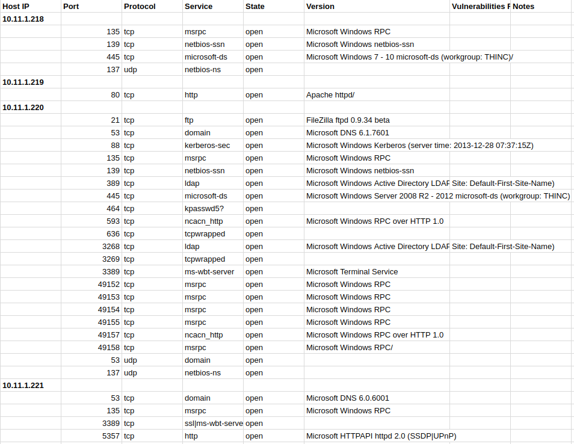

# Network Scanner

Generate a csv file with information on the open ports of hosts in a network.

## Usage

```bash
git clone git@github.com:evanrolfe/NetworkScanner.git
cd NetworkScanner
ruby ruby scan.rb 192.168.0.1 192.168.0.2 192.168.0.3 > network_hosts.csv
```

The generate file `network_hosts.csv` can then be opened using a spreadsheet editor i.e.


